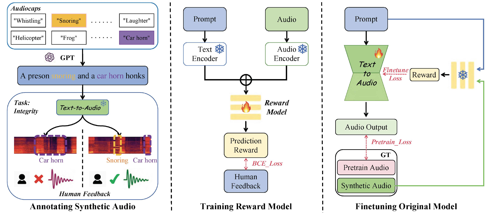

# BATON: Aligning Text-to-Audio Model with Human Preference Feedback

<a href="https://arxiv.org/abs/2402.00744"></a> 
<a href="https://baton2024.github.io/"></a>
<a href="https://drive.google.com/drive/folders/1dzsvxn6XLcqhi19n2kzk1jzD1ZnlbM4T?usp=sharing"></a>

With the development of AI-Generated Content (AIGC), text-to-audio models are gaining widespread attention. However, it is challenging for these models to generate audio aligned with human preference due to the inherent information density of natural language and limited model understanding ability. To alleviate this issue, we formulate the **BATON**, **the first framework specifically designed to enhance the alignment between generated audio and text prompt using human preference feedback**. Our BATON comprises three key stages: Firstly, we curated a dataset containing both prompts and the corresponding generated audio, which was then annotated based on human feedback. 
Secondly, we introduced a reward model using the constructed dataset, which can mimic human preference by assigning rewards to input text-audio pairs. Finally, we employed the reward model to fine-tune an off-the-shelf text-to-audio model. The experiment results demonstrate that our BATON can significantly improve the generation quality of the original text-to-audio models, concerning audio integrity, temporal relationship, and alignment with human preference.



## Todo List
- [x] 🔥 Release on arxiv!
- [x] 🔥 Release demo page!
- [x] 🔥 Release human perfence dataset!
- [ ] Release Reward model training code
- [ ] Release finetuning code based on tango
- [ ] Release finetuning code based on AudioLDM

## Repository Overview
We provide an example of how you can Aligning Text-to-Audio Model with any of your specific preferences using Baton. And we are releasing our implementation of finetuning one of the SOTA text-to-audio model [Tango](https://github.com/declare-lab/tango), while supporting imporve more T2A models or other audio generation models.

* `configs`: Configuration files for training and evaluation.
* `data`: The audio for human annotation
    * `Audio`:
        * `2label_Integrity_HD_Audio`: Audio of 2 label prompt annotated by human
        * `2label_Integrity_RD_Audio`: Audio of 2 label prompt annotated by reward model
        * `3label_Temporal_HD_Audio`: Audio of 3 label prompt annotated by human
        * `3label_Temporal_HD_Audio`: Audio of 3 label prompt annotated by reward model
    * `HA`: Human annotation
    * `RA`: Reward model annotation
* `scripts`: Helper scripts
    * `finetune.sh`: Fine-tuning t2a Model
    * `inference_finetune.sh`: Inference using t2a model after fine-tuning
* `src`: Source code
    * `eval`: Quantitative evaluation (FAD/FD/IS/KL/CLAP)
    * `rewardmodel`: Reward model definitions
        * `RM_inference_2label_BCE.py`: Inference using reward model
        * `RM_inference_2label_Preference_BCE.py`: Inference using reward model
        * `RM_train_2label_BCE.py`: Train reward model using preference annotation
        * `RM_train_2label_Preference_BCE.py`: Train reward model using absolute annotation
    * `t2amodel`: T2A model
        * `Tango-master(example)`: Any text-to-audio model
            * `finetune.py`: move under this path
            * `models.py`: move and replace origin one


## Quick Start
We provide an example of how you can Aligning Text-to-Audio Model with any of your specific preferences using Baton. And we take one of the SOTA text-to-audio model [Tango](https://github.com/declare-lab/tango) as example.


### Datasets

The 2.5k pretain data are random seleted from [AudioCaps](https://github.com/cdjkim/audiocaps) train set. The audio locations, corresponding captions and scores are specified in the *.json file in ./Data.

The audio for human annotation, generated by [Tango](https://github.com/declare-lab/tango) based on the checkpoint[Tango-Full-FT-AudioCaps](https://huggingface.co/declare-lab/tango-full-ft-audiocaps) by feeding 2 or 3 label prompts, is available in [Google drive](https://drive.google.com/drive/folders/1dzsvxn6XLcqhi19n2kzk1jzD1ZnlbM4T?usp=sharing).

**PD, HD and RD** separately represents for pretrain data, human and reward model labeled data.

For **Integrity** task, Download:

    2label_Integrity_HD_Audio and put it into /data
    2label_Integrity_RD_Audio and put it into /data

For **Temporal** task, Download:

    3label_Temporal_HD_Audio and put it into /data
    3label_Temporal_RD_Audio and put it into /data

### Fine-tuning T2A Model

We are releasing our implementation based on one of the SOTA T2A model [Tango](https://github.com/declare-lab/tango), based on the checkpoint [Tango-Full-FT-AudioCaps](https://huggingface.co/declare-lab/tango-full-ft-audiocaps). 

#### Preparation

```bash
cd src/rewardmodel
git clone https://github.com/declare-lab/tango.git
cd tango
mkdir ckpt
download checkpoint [Tango-Full-FT-AudioCaps](https://huggingface.co/declare-lab/tango-full-ft-audiocaps) and put it under ckpt
```

```bash
put 'finetune.py' under ./tango
modify the 'models.py' line 207
from:
   loss = loss.mean()
to:
   loss1 = loss
   loss2 = loss.mean
return loss1, loss2 
```

#### Dataset
```python
python ./bat/src/data/dataset_make.py # For human and reward model score
```

#### Settings for Multi-GPU
```bash
accelerate config
```

#### Fine-tuning
```bash
bash ./scripts/finetune.sh
```

### Reward Model Training and Annotating

**Train Reward Model**
```python
cd RM
python RM_train_2label_BCE.py # For Integrity task
python RM_train_3label_BCE.py # For Temporal task
```

**Using Reward Model for Annotation**
```python
cd RM
python RM_inference_2label_BCE.py # For Integrity task
python RM_inference_3label_BCE.py # For Temporal task
```

### Inference Using After-Fine-tuning T2A Model
```bash
bash ./scripts/inference_finetune.sh
```

## Evaluation
Copy your inference result from 'bat/src/t2amodel/tango/output' to '/home/hhn/bat/src/eval/output'

- Caculate FAD, FD, IS, KL

```python
cd bat/src/eval
python metric_caculate.py # 
```
- Caculate CLAP consistency

To compute the clap_consistency, we call the api from [Audiocraft](https://facebookresearch.github.io/audiocraft/api_docs/audiocraft/metrics/clap_consistency.html). 

```bash
git clone https://github.com/facebookresearch/audiocraft.git
```
Then put 'clap_caculate.py' under audiocraft/audiocraft

```python
python clap.py \
--model_path /home/audiotest/tango-master/ckpt/630k-audioset-fusion-best.pt \
--model_arch HTSAT-tiny \
--audio_folder /home/audiotest/tango-master/outputs/1709389247_home_audiotest_tango-master_saved_1709334661_epoch_10_steps_200_guidance_3.0/rank_1 \
--output_json clap_1709389247_1709334661_epoch_10.json
```


